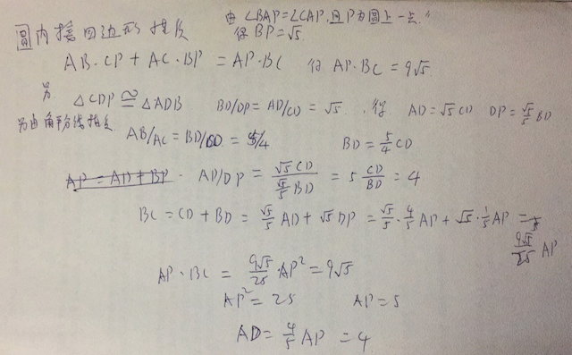

# Cyclic Quadrilateral Problem in Japanese College Entrance Examination

## what it the length of AD?

-----
Solution:

* [Cyclic quadrilateral](https://en.wikipedia.org/wiki/Cyclic_quadrilateral)
* [圆内接四边形](https://zh.wikipedia.org/wiki/%E5%9C%86%E5%86%85%E6%8E%A5%E5%9B%9B%E8%BE%B9%E5%BD%A2)
* [托勒密定理](https://zh.wikipedia.org/wiki/%E6%89%98%E5%8B%92%E5%AF%86%E5%AE%9A%E7%90%86)
